# Full-Stack E-Commerce Platform

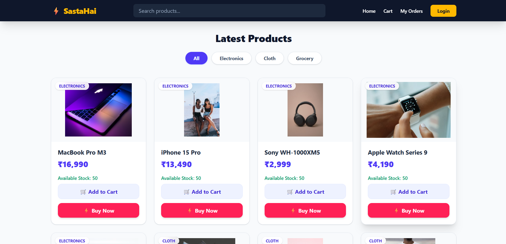

A comprehensive, robust e-commerce application designed with a microservices-ready backend architecture and an intuitive frontend interface. This project demonstrates end-to-end full-stack development capabilities, featuring secure user authentication, product catalog management, seamless order processing, and third-party payment integration.

## Visual Walkthrough

### Secure Authentication & Authorization
Implements Spring Security with OAuth2 (Google) and custom OTP-based email verification via Gmail SMTP.

**Standard & OAuth2 Login:**
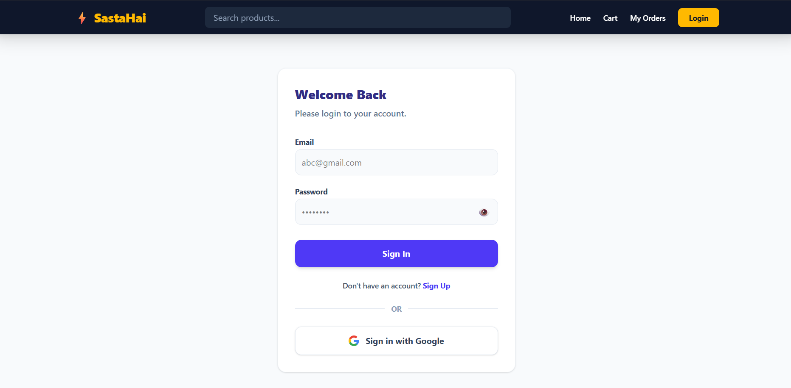


**Account Creation & OTP Verification:**
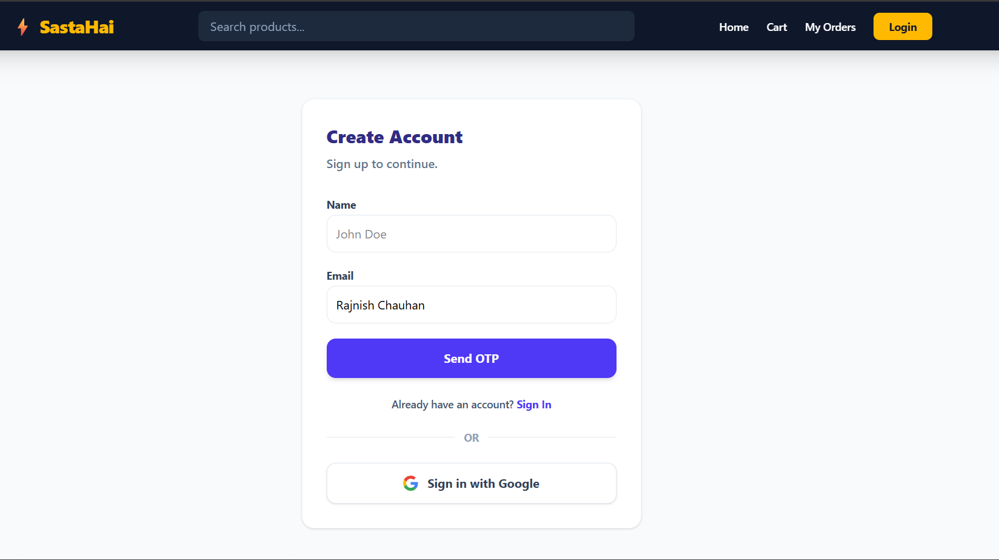

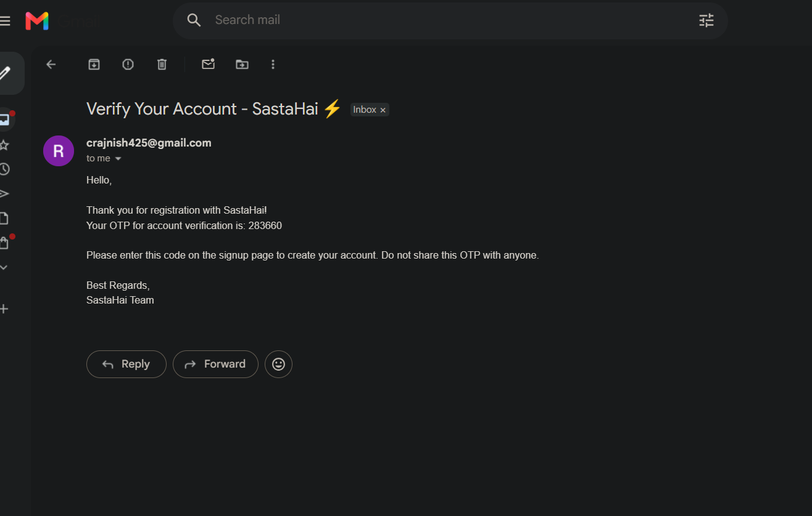

### 🛒 Cart, Checkout & Order Management
Integrated with Razorpay for secure, real-time checkout and payment processing. Includes automated email confirmations for successful orders.

**Shopping Cart & Payment Success:**
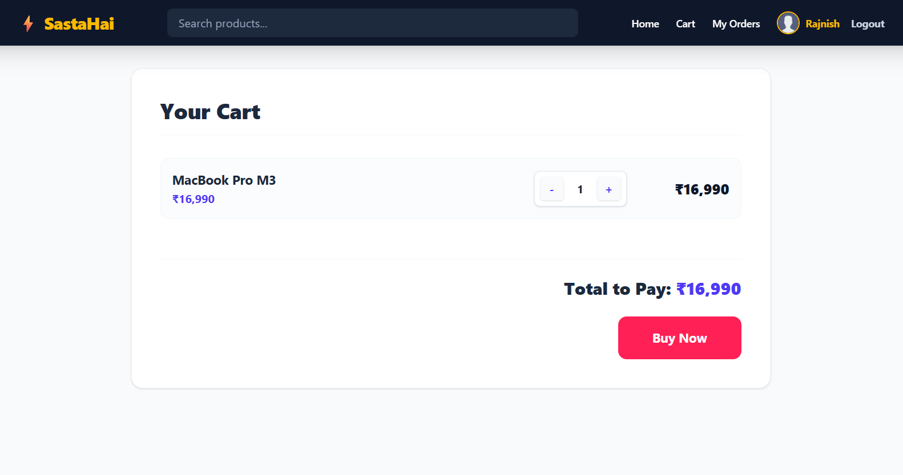
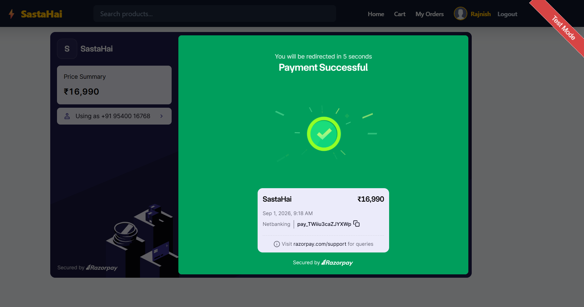

**Order History & Email Confirmation:**
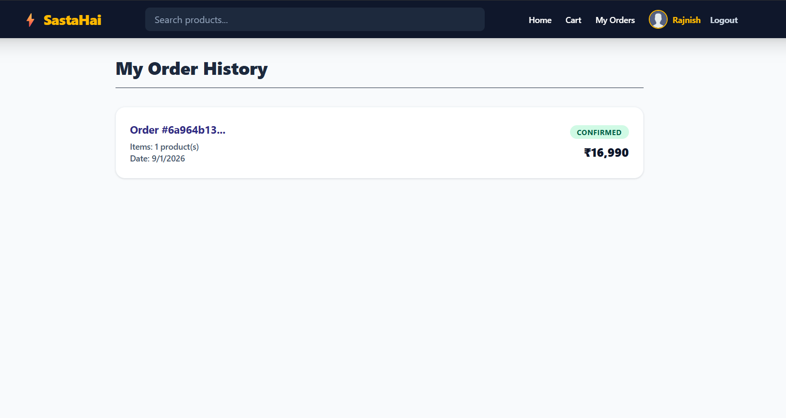
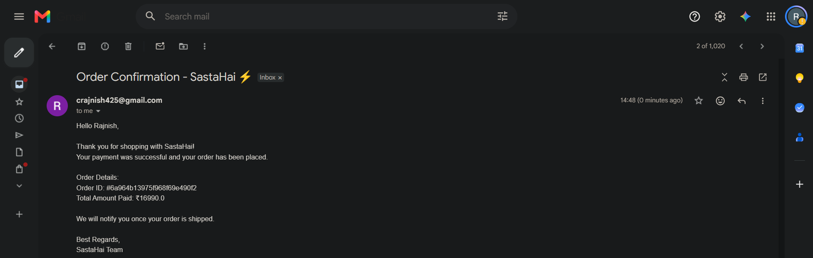

### ⚙️ Admin Panel & Product Management
Dedicated role-based access for Admins to manage the product catalog seamlessly.

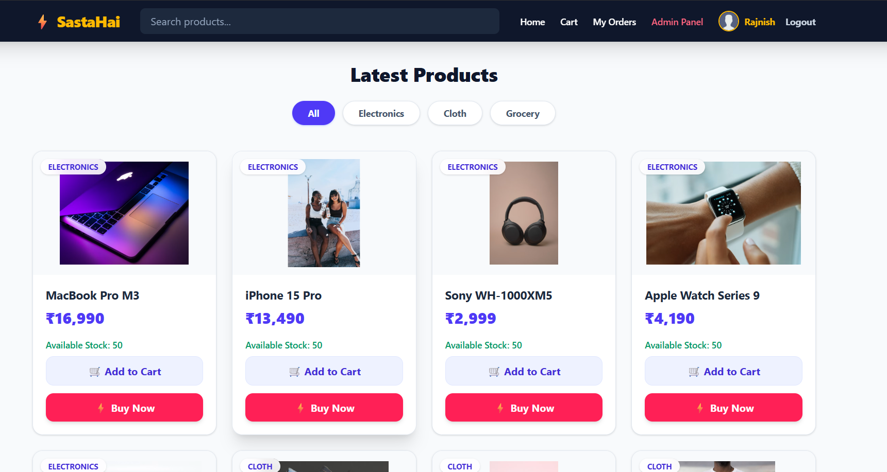
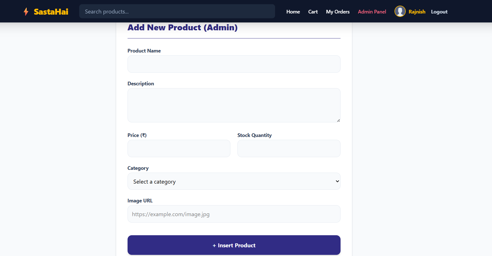
* Database

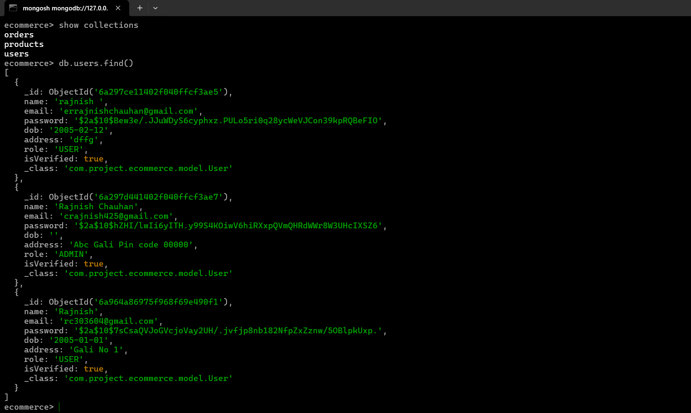
---

##  Key Features

*   **Secure Authentication & Authorization:** Implements Spring Security with OAuth2 (Google) and custom OTP-based email verification via Gmail SMTP.
*   **Payment Gateway Integration:** Integrated with Razorpay for secure, real-time checkout and payment processing.
*   **Robust Backend Architecture:** Built with Java 21 and Spring Boot, utilizing an MVC pattern with dedicated Controllers, Services, Repositories, and DTOs.
*   **NoSQL Database:** MongoDB integration for flexible, scalable storage of users, products, and complex order schemas.
*   **Modern Frontend:** A responsive user interface built with React and Vite, utilizing Context API for global state management (Auth and Cart) and Axios for seamless backend API consumption.
*   **Containerized Deployment:** Docker-based deployment configuration ensuring consistent environments across development and production.

##  Technology Stack

### Backend
*   **Language:** Java 21
*   **Framework:** Spring Boot, Spring Security, Spring Web MVC
*   **Database:** MongoDB
*   **Infrastructure & Tools:** Docker, Maven
*   **Integrations:** Google OAuth2, Razorpay API, JavaMailSender (SMTP)

### Frontend
*   **Library:** React.js
*   **Build Tool:** Vite
*   **Styling:** Tailwind CSS
*   **State Management:** React Context API (`AuthContext`, `CartContext`)
*   **Routing & Networking:** React Router (`ProtectedRoute`), Axios

## 📂 Project Structure

### Backend Core Modules
*   `config/`: Security filter chains, OAuth2 configs, and MongoDB connection setups.
*   `controller/`: REST API endpoints handling client requests.
*   `service/`: Business logic layer (`EmailService`, `OrderService`, `PaymentService`, etc.).
*   `repo/`: Data access layer for MongoDB repositories.
*   `model/` & `dto/`: Domain entities (`User`, `Product`, `Orders`) and Data Transfer Objects.

### Frontend Core Modules
*   `api/`: Axios client configuration for backend communication.
*   `components/`: Reusable UI elements (`Navbar`, `ProductCard`, `ProtectedRoute`).
*   `pages/`: Application views (`Home`, `Cart`, `MyOrders`, `AdminAddProduct`, `Profile`).
*   `context/`: Global state providers for cart data and authentication status.

##  API Reference

The backend exposes the following primary REST endpoints (configured with `.permitAll()` for testing environments):

**Users & Authentication (`/users`, `/api/otp`)**
*   `POST /users/register` - Register a new user account.
*   `POST /users/login` - Authenticate user.
*   `PUT /users/update/{id}` - Update user profile.
*   `GET /users/by-email` - Fetch user details by email.
*   `POST /api/otp/send` - Trigger email OTP generation.
*   `POST /api/otp/verify` - Validate user OTP.

**Products Catalog (`/products`)**
*   `POST /products/add` - Add a new product (Admin).
*   `GET /products/all` - Retrieve the complete product catalog.
*   `GET /products/{id}` - Retrieve details of a specific product.

**Order Management (`/orders`)**
*   `POST /orders/place/{userId}` - Place a new order from the cart.
*   `GET /orders/all-orders` - Retrieve all orders (Admin).
*   `GET /orders/user/{userId}` - Retrieve order history for a specific user.

**Payments (`/api/payment`)**
*   `POST /api/payment/create-order` - Initialize a Razorpay payment session.

## Comprehensive Setup Guide
Follow these step-by-step instructions to get the project running on your local machine.

### Prerequisites
Before you begin, ensure you have the following installed:
* Java Development Kit (JDK) 21
* Node.js (v19 or higher) and npm
* MongoDB (Local instance or MongoDB Atlas cluster)
* Docker (Optional, for containerized deployment)
* Maven (For backend dependency management)

### Step 1: Backend Setup
* Clone the Repository:
```text
git clone [https://github.com/Rajnish-chauhan/ecommerce.git](https://github.com/Rajnish-chauhan/ecommerce.git)
```
  Navigate to src/main/resources/application.properties (or application-test.properties as per your active profile) and update the following values:
```text
spring.application.name=Ecommerce
spring.profiles.active=test

# MongoDB Configuration
spring.data.mongodb.uri=mongodb://localhost:27017/ecommerce_db # Or your Atlas URI

# Google OAuth2 Configuration
spring.security.oauth2.client.registration.google.client-id=YOUR_GOOGLE_CLIENT_ID
spring.security.oauth2.client.registration.google.client-secret=YOUR_GOOGLE_CLIENT_SECRET
spring.security.oauth2.client.registration.google.scope=profile,email

# Razorpay Configuration
razorpay.key.id=YOUR_RAZORPAY_KEY_ID
razorpay.key.secret=YOUR_RAZORPAY_KEY_SECRET
server.forward-headers-strategy=framework

# Email Configuration (Gmail SMTP)
spring.mail.host=smtp.gmail.com
spring.mail.port=587
spring.mail.username=YOUR_GMAIL_ADDRESS
spring.mail.password=YOUR_GMAIL_APP_PASSWORD # Use an App Password, not your standard password
spring.mail.properties.mail.smtp.auth=true
spring.mail.properties.mail.smtp.starttls.enable=true
```
* Build and Run the Backend:
```text
mvn clean install
mvn spring-boot:run
```
The backend API will start on http://localhost:8080.
* Docker Deployment (Alternative):
  If using Docker, ensure your Dockerfile is configured, then run:
```text
docker build -t ecommerce-backend .
docker run -p 8080:8080 ecommerce-backend
```
### Step 2: Frontend Setup
* Navigate to the Frontend Directory:
```text
cd ../frontend
```
* Install Dependencies:
```text
npm install
```
* Configure Environment Variables:
  Create a .env file in the root of the frontend directory and add the necessary API endpoints and keys:
```text
VITE_API_BASE_URL=http://localhost:8080
VITE_RAZORPAY_KEY_ID=YOUR_RAZORPAY_KEY_ID
```
* Start the Development Server:
```text
npm run dev
```
The Vite server will typically start on http://localhost:5173.
### Step 3: DataBase Setup
**Database Initialization (MongoDB):**
Ensure MongoDB is running locally (or you have an Atlas cluster).
*   Connect to your MongoDB instance via Mongo Shell (`mongosh`) or your terminal.
*   Execute the following commands to create the database and required collections:

    ```text
    // 1. Create and switch to the ecommerce database
    use ecommerce

    // 2. Create the necessary collections
    db.createCollection("users")
    db.createCollection("products")
    db.createCollection("orders")

    // 3. Verify the collections were created successfully
    show collections
    
    // Expected output:
    // orders
    // products
    // users
    ```
    *   *Note:* While Spring Data MongoDB will automatically generate these collections upon the first data insertion, explicitly creating them ensures the database schema is fully initialized before the application starts.
---
## 🤝 Let's Connect

**Rajnish Chauhan** | Backend Software Engineer

*Engineered with a focus on scalable backend system design, clean code principles, and seamless third-party service integration.*

I am a Backend Developer passionate about building scalable APIs and robust backend systems using Java and Spring Boot. Check out my other projects or get in touch!

**🌐 Portfolio:** [rajnishsystems.in](https://rajnishsystems.in)
